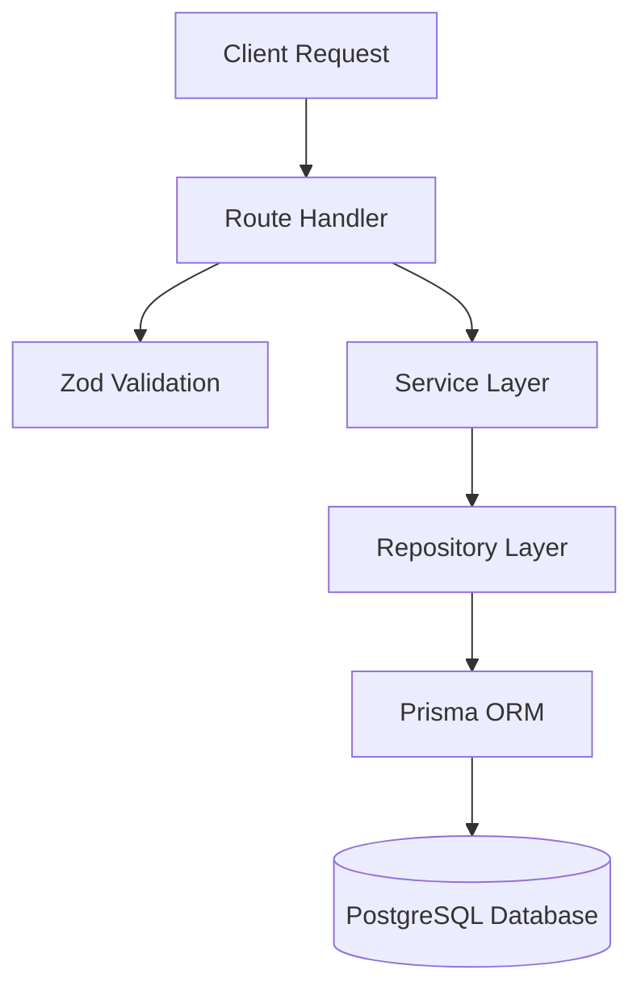

# Home4Stay Authentication Architecture

This document defines the mandatory architecture and implementation rules established during Sprint 1. All future development **must** adhere strictly to these guidelines to ensure consistency, security, and maintainability.

## 1. Layer Diagram

The architecture enforces a strict unidirectional data flow:



*Note: Data flows downwards. A layer may only interact with the layer directly beneath it.*

## 2. Responsibility of Every Layer

- **Route Layer (`app/api/...`)**: Acts as a thin controller. It intercepts the HTTP request, invokes validation, delegates to the Service Layer, and formats the HTTP response (setting cookies, status codes, etc.).
- **Validation Layer (`lib/validations/...`)**: Strictly ensures that incoming payload structures are safe and syntactically correct before they reach business logic.
- **Service Layer (`lib/auth/auth.service.ts`, etc.)**: The brain of the application. Owns all business workflows, credential management, token orchestration, and aggregate coordination.
- **Repository Layer (`lib/repositories/...`)**: The exclusive gateway to the database. Abstracts away Prisma and handles direct querying, mutations, and database transactions.

## 3. Forbidden Responsibilities

- **Route Layer**: MUST NOT contain business rules, database queries, password hashing, or token generation.
- **Validation Layer**: MUST NOT perform database lookups, async operations, or contain any business logic.
- **Service Layer**: MUST NOT interact directly with Prisma, import `NextRequest` / `NextResponse`, or format HTTP-specific objects (like cookies).
- **Repository Layer**: MUST NOT contain business logic, password hashing, or throw HTTP-specific errors.

## 4. Repository Rules

1. **Prisma Isolation**: Repositories are the **only** files allowed to import and use the `prisma` client.
2. **Transactions**: Cross-aggregate transactions must be handled entirely within a repository method (e.g., `createPartner` in `UserRepository`).
3. **No Business Logic**: A repository should only perform CRUD operations and return data.

## 5. Service Rules

1. **No Database Access**: Services must delegate all data persistence and retrieval to Repositories.
2. **No HTTP Awareness**: Services must return pure JavaScript objects or primitives. They must never know about `NextRequest`, `NextResponse`, or cookies.
3. **Single Source of Truth**: There must be exactly ONE implementation of every business workflow. Duplicated logic is strictly prohibited.

## 6. Route Rules

Every API route must follow a strict "Thin Controller" pattern:
1. Parse the incoming request (`request.json()`).
2. Validate the request using Zod.
3. Invoke the corresponding Service method.
4. Return data using the `successResponse()` utility.
5. Wrap the entire handler in the `withErrorHandler()` higher-order function.
6. Handle API-layer security (Rate Limiting, Brute Force protection) if applicable.

## 7. Validation Rules

1. **Centralization**: All authentication schemas must live in `lib/validations/auth.schema.ts`.
2. **Reusability**: Shared fields (like `PASSWORD_REGEX`) must be extracted and reused.
3. **Pure Functions**: Schemas must be synchronous and pure. Do not inject Prisma calls or async database checks into Zod schemas.

## 8. Error Handling Flow

- **Throwing Errors**: The Service Layer should throw standard JavaScript `Error` objects with descriptive messages (e.g., `throw new Error("Invalid credentials")`).
- **Catching Errors**: The `withErrorHandler` utility intercepts all thrown errors, logs them to the central logger (with metrics), and formats them safely for the client.
- **HTTP Status Codes**: `withErrorHandler` maps known error messages to appropriate HTTP status codes (400, 401, 403, etc.) and defaults to 500 for unhandled exceptions.

## 9. API Response Standard

All successful API responses MUST use the `successResponse()` wrapper from `lib/utils/apiResponse.ts`.

**Structure:**
```json
{
  "success": true,
  "data": { ... },
  "message": "Optional success message",
  "meta": { ... }
}
```
This guarantees symmetry with the standardized error response format (`{ "success": false, "error": "..." }`).

## 10. Future Implementation Guidelines

1. **Feature Implementation**: When building new features (Booking, Payments, CMS, etc.), this exact Layer architecture must be replicated.
2. **New Repositories**: Create a new repository for each major domain aggregate (e.g., `BookingRepository`, `PropertyRepository`).
3. **New Services**: Create dedicated services for business domains (e.g., `BookingService`).
4. **Strict Adherence**: Code reviews must reject any PR that introduces Prisma into a Service, business logic into a Route, or duplicated workflows.
